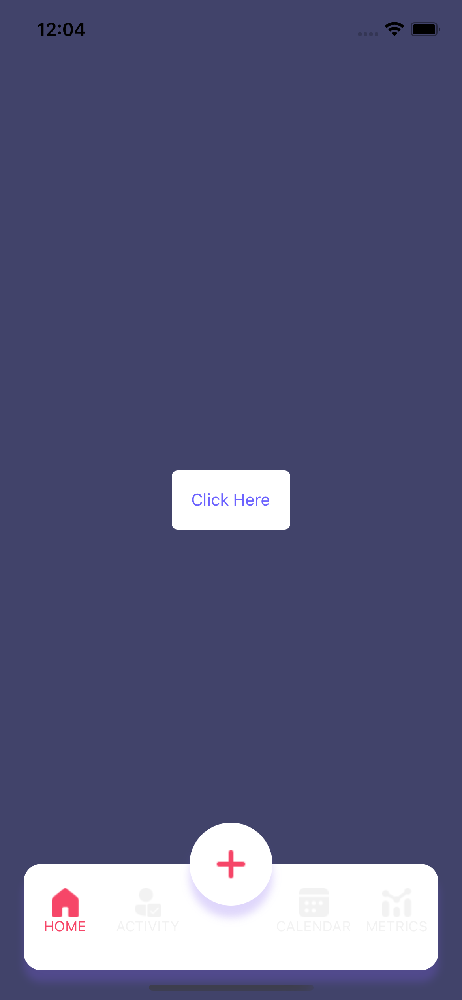
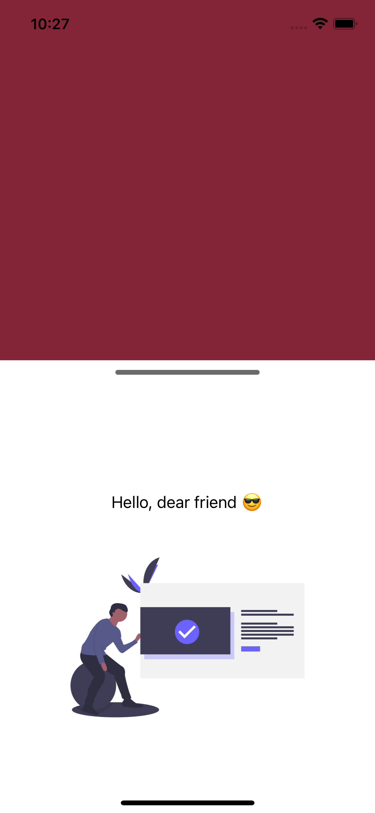
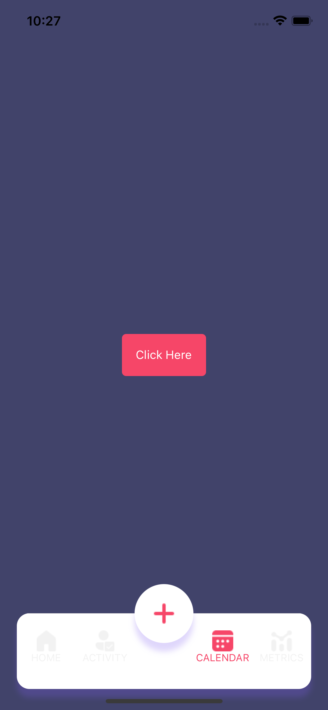

<!-- ABOUT THE PROJECT -->
## Costum Bottom Demo

<!-- ABOUT THE PROJECT -->
## About The Project

Single module for new design of [Lezgo](https://www.lezgo.io) mobile app that will be implemented soon.
## Screens:
<p align="center">
    
    
    
</p>

## Setup Project

Run these following commands after clone:

```
yarn install
```

```
yarn start
```


